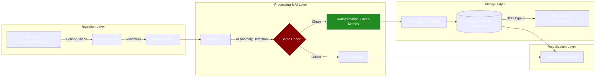

# 🚀 Eco-Commerce Data Platform

**Author:** Lesego

**Date:** February 2026

**Stack:** Python, Apache Airflow, PostgreSQL, Docker, Streamlit

## 📖 Overview

The Eco-Commerce Data Platform is a cloud-ready, end-to-end data engineering solution designed to ingest, process, and analyze sustainable product sales data. The system automates the lifecycle of data—from raw file drops to a partitioned PostgreSQL warehouse—while calculating environmental impact metrics and identifying data anomalies using Machine Learning.

---

## 🏗️ Architecture & Flow

The project is built on a modular, containerized architecture for maximum portability:



* **Ingestion (Bash)**: Shell scripts act as file sensors, validating data integrity and logging "heartbeat" statuses to the database.
* **Orchestration (Airflow)**: A daily DAG manages task dependencies: `file_sensor` → `extract` → `transform` → `load` → `cleanup`.
* **AI Transformation (Python)**: Uses `scikit-learn` Isolation Forest and Z-Score logic to flag sales outliers and calculate `carbon_savings`.
* **Warehouse (Postgres)**: A Star Schema optimized with **Range Partitioning** and **SCD Type 2** tracking.

---

## ⚡ Performance & Warehouse Design

This warehouse is engineered for speed and historical accuracy.

### **High-Performance Partitioning**

The `fact_sales` table is range-partitioned by `sale_timestamp` into monthly segments.

* **Optimization**: This enables partition pruning, resulting in a verified query execution time of **0.063 ms**.

### **Slowly Changing Dimensions (SCD Type 2)**

Dimensions for `products` and `customers` utilize Type 2 logic with `is_current` flags and effective date ranges.

* **Traceability**: This allows the business to report on historical pricing and loyalty status exactly as they were at the time of a transaction.

---

## 📊 Monitoring Dashboard

A real-time **Streamlit** dashboard provides pipeline observability:

* **Pipeline Health**: Monitor latest ingestion status (RUNNING/SUCCESS/FAILED).
* **Data Quality**: Track null counts and duplicate records across every run.
* **Volume Trends**: Visualize data growth over time.

---

## 🛠️ Setup & Deployment

This project is fully containerized using Docker.

### **Prerequisites**

* Docker & Docker Compose
* A `.env` file containing: `ECO_DB_PASSWORD`, `SMTP_PASSWORD`, and `ALERT_EMAIL`.

### **Running Locally**

1. **Clone the Repo**: `git clone <repo-url>`
2. **Start Services**: `docker-compose up -d`.
3. **Access Airflow**: `localhost:8080` (Username/Password: `airflow`)
4. **Access Dashboard**: `localhost:8501`

---

## 📁 Repository Structure

```text
├── dags/             # Airflow DAGs
├── etl/              # Python Extract, Transform, Load scripts
├── raw_data/         # Input data directory (Ignored by Git)
├── Schema.sql        # Warehouse DDL (Partitions, SCD2, Indexes)
├── dashboard.py      # Streamlit Monitoring App
├── Dockerfile        # Custom Airflow + Postgres Client image
└── docker-compose.yml# Multi-container orchestration

```

---
